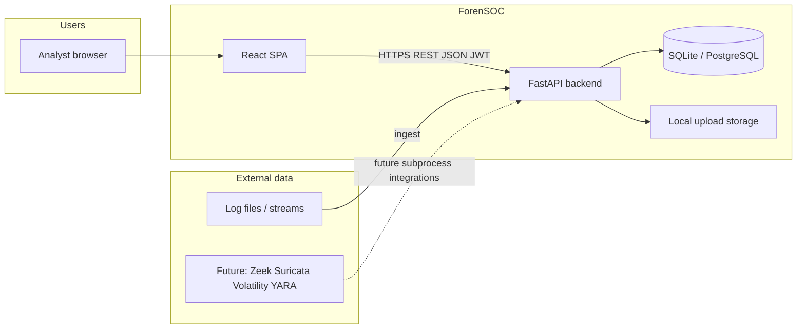
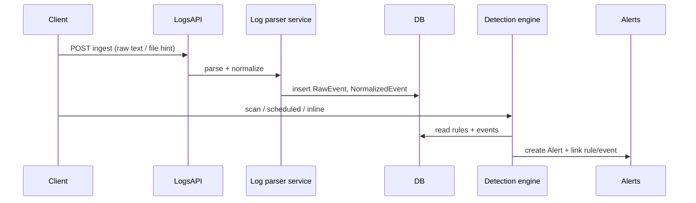

# ForenSOC — System Design

This document describes **what ForenSOC is**, **how the current codebase is structured**, and **how it is intended to evolve**. It complements `PROJECT_DESIGN.md` (long-form reference) and `IMPLEMENTATION_ROADMAP.md` (phased delivery). When this file disagrees with older docs, **prefer this file for the React + current API layout**.

---

## 1. Purpose and scope

**ForenSOC** is an integrated **SOC + DFIR** platform: ingest security-relevant data (logs first; PCAP, memory, files, and browser artifacts later), **normalize** events, **detect** suspicious patterns, manage **cases** and **alerts**, attach **evidence** with **chain of custody**, reconstruct **timelines**, map activity to **MITRE ATT&CK**, and export **reports**.

**In scope (product)**

- Multi-user operation with **JWT authentication** and **role-based access** (admin, analyst, investigator, viewer).
- **Case** and **alert** lifecycle for investigations.
- **Log pipeline**: raw ingest → structured/normalized events → rule engine → alerts.
- Forensic modules (evidence vault, network, memory, YARA, timeline, PDF reports) as **incremental** capabilities backed by existing SQLAlchemy models.

**Out of scope (for early releases)**

- Multi-tenant SaaS isolation, full SIEM-scale log storage, and managed cloud deployment (design allows adding them later).

---

## 2. Stakeholders and quality attributes

| Stakeholder        | Need                                      | Design implication                                      |
|-------------------|--------------------------------------------|---------------------------------------------------------|
| Analyst           | Fast triage of alerts and logs             | Filtered list APIs, Log Explorer UI, clear severity     |
| Investigator      | Defensible evidence and audit trail        | Evidence + chain of custody models and APIs (to build) |
| Admin             | Users, roles, detection rules              | Auth/users APIs, rule CRUD, startup defaults           |
| Operator / DevOps | Simple deploy, health checks, configuration | Docker, env-based `Settings`, `/health`               |

**Quality priorities**: traceability (event → alert → case), integrity (hashes, CoC), clarity of API contracts (OpenAPI), and **evolvability** (services per domain, thin routers).

---

## 3. System context



---

## 4. Container architecture (current)

| Container            | Technology              | Responsibility |
|----------------------|-------------------------|----------------|
| Web UI               | React 18, TypeScript, MUI, Vite | Auth shell, navigation, pages for dashboard, cases, alerts, logs, detection rules, reports/settings placeholders |
| API                  | FastAPI, Pydantic, SQLAlchemy   | REST API, auth, persistence, orchestration of parsers and detection |
| Database             | SQLite (default) or PostgreSQL  | ORM-managed schema; `Base.metadata.create_all` at startup in current app |
| Object/file storage  | Filesystem (`UPLOAD_DIR`)       | Intended for evidence and large artifacts; wired in settings |

**API base paths**: OpenAPI at `/api/docs`, `/api/redoc`; routers are mounted without a global `/api` prefix on each router file—see section 6 for concrete routes.

---

## 5. Backend logical design

### 5.1 Layering

```
api/          → HTTP, dependencies, request/response models (Pydantic)
crud/         → DB queries and transactions
services/     → Domain logic (parsing, detection, future analyzers)
models/       → SQLAlchemy entities
schemas/      → Pydantic I/O schemas
config.py     → Central settings (env)
database.py   → Engine and session
```

**Rule**: routers stay thin; non-trivial logic lives in `services/` or `crud/`.

### 5.2 Implemented API surfaces (routers registered in `main.py`)

| Router        | Module            | Role |
|---------------|-------------------|------|
| `auth`        | `app.api.auth`    | Login, register, token refresh, current user |
| `users`       | `app.api.users`   | User management (role-aware) |
| `cases`       | `app.api.cases`   | Case CRUD and notes |
| `alerts`      | `app.api.alerts`  | Alert CRUD and workflow |
| `logs`        | `app.api.logs`    | Log ingest, raw/normalized listing, detail |
| `detection`   | `app.api.detection` | Detection rules CRUD/toggle, detection-tied alerts, scan triggers |

### 5.3 Core domain entities (persisted)

Declared in `app.models` (see `models/__init__.py`): **User**, **Role**, **RawEvent**, **NormalizedEvent**, **Case**, **CaseNote**, **Alert**, **AlertNote**, **Evidence**, **ChainOfCustody**, **TimelineEvent**, **MitreMapping**, **YaraResult**, **VolatilityResult**, **PCAPAnalysis**, **BrowserArtifact**, **Report**. Additional types such as **DetectionRule** live alongside these for the detection subsystem.

**Design intent**: forensic and reporting tables exist early so APIs and services can be added without schema refactors; empty tables are acceptable before those phases ship.

### 5.4 Log and detection pipeline (as implemented)



- **Normalization** produces a common column set for search and for rules (IPs, user, host, event type, severity, outcome, message, time).
- **Detection** uses stored **DetectionRule** rows (defaults seeded on startup in `main.py` via `RuleManager`).

### 5.5 Security model

- **JWT** access tokens; passwords hashed (bcrypt) in user CRUD.
- **RBAC**: roles created at startup (`admin`, `analyst`, `investigator`, `viewer`); endpoints use dependencies in `app.api.dependencies` for consistent authorization (extend as new routers appear).
- **CORS**: `ALLOWED_ORIGINS` in `Settings` includes the React dev origin (`http://localhost:3000`).
- **Secrets**: `SECRET_KEY` and admin bootstrap credentials must be overridden in production via environment.

### 5.6 Planned backend modules (not yet wired as routers)

Aligned with `PROJECT_DESIGN.md` and `IMPLEMENTATION_ROADMAP.md`: dedicated routers for **evidence**, **PCAP**, **memory**, **files/browser**, **timeline**, **reports**, **YARA**, **MITRE dashboard**, plus **Celery** workers under `tasks/` for long-running forensics. Configuration already reserves paths (`VOLATILITY_PATH`, `ZEEK_PATH`, `YARA_PATH`) and upload limits.

---

## 6. Frontend application design

### 6.1 Information architecture

| Route              | Page                 | Purpose |
|--------------------|----------------------|---------|
| `/login`, `/register` | Login, Register   | JWT acquisition |
| `/dashboard`       | Dashboard            | Summary metrics (extend with live stats) |
| `/cases`, `/cases/:id` | Cases, Case detail | Investigation containers |
| `/alerts`          | Alerts               | Triage and management |
| `/logs`            | Log Explorer         | Search/filter normalized events |
| `/detection-rules` | Detection rules      | Rule management UI |
| `/reports`         | Reports              | Placeholder for PDF/report list |
| `/settings`        | Settings             | Placeholder / preferences |

**Shell**: `App.tsx` restores session from `localStorage`, loads current user, shows `Navigation` when authenticated, and wraps main content in `Container maxWidth="xl"` for authenticated routes.

**State**: Zustand stores for auth, UI (e.g. dark mode), and alert badge counts; API access centralized in `apiService.ts`.

### 6.2 UX principles

- **Operational clarity**: tables with filters, consistent severity coloring, drill-down from list to detail.
- **One mental model**: Case-centric work—eventually link alerts, evidence, and timeline entries to cases from detail views.
- **Progressive disclosure**: Log Explorer and Case detail use tabs or panels for raw vs normalized views where applicable.

---

## 7. Configuration and deployment

- **Environment**: `backend/.env` from `.env.example`; `Settings` uses `pydantic-settings`.
- **Database URL**: default SQLite file for MVP; PostgreSQL recommended for concurrent teams.
- **Uploads**: `UPLOAD_DIR` and `MAX_UPLOAD_SIZE` govern evidence and artifact storage.
- **Docker**: Compose targets backend + DB + React per `IMPLEMENTATION_ROADMAP.md`; React app lives under `frontend-react/` (legacy Streamlit paths in some docs should be treated as historical).

---

## 8. Evolution: phase mapping

| Phase (roadmap) | Design focus in this repo |
|-----------------|---------------------------|
| Foundation      | Auth, users, cases, alerts, OpenAPI, React shell |
| Logs + detection| `logs` + `detection` APIs, `log_parser`, `detection_engine`, Log Explorer + Rules UI |
| Evidence        | Evidence upload API, hashing service, CoC writer, Evidence Vault UI |
| Network / memory| PCAP and Volatility services, async jobs, dedicated pages |
| Timeline + MITRE| `TimelineBuilder`-style service reading multiple tables |
| Reporting       | `ReportGenerator`, PDF, Reports page downloads |

---

## 9. Related documents

- `PROJECT_DESIGN.md` — detailed directory blueprint and narrative.
- `DATABASE_SCHEMA.md` — table-level reference.
- `ARCHITECTURE_AND_API.md` — API specification (keep in sync when endpoints change).
- `PHASE2_DESIGN.md` — log/detection deep dive.
- `IMPLEMENTATION_ROADMAP.md` — week-by-week delivery checklist.

---

## 10. Document control

| Version | Date       | Notes |
|---------|------------|--------|
| 1.0     | 2026-05-13 | Initial system design aligned with React + FastAPI codebase |
