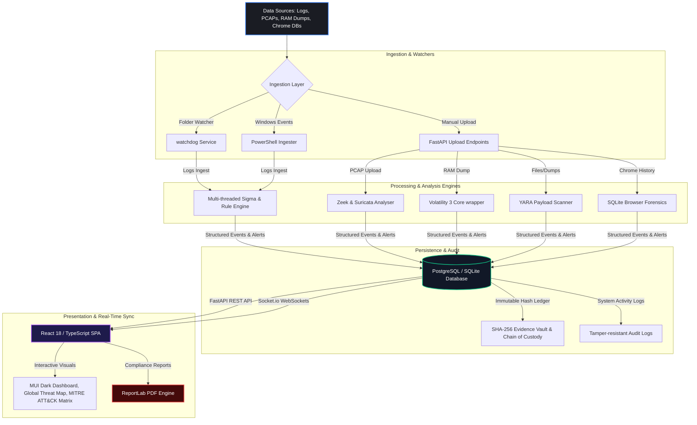

# 🛡️ ForenSOC

<p align="center">
  
  
  
  
  
  
  
  
</p>

### **Enterprise-Grade Security Operations Center (SIEM) & Orchestrated Digital Forensics (DFIR) Platform**

**ForenSOC** is a state-of-the-art, open-source **Security Operations Center (SOC)** and **Digital Forensics & Incident Response (DFIR)** platform. Designed to meet the standards of professional cybersecurity analysts and incident responders, ForenSOC integrates high-performance log ingestion, real-time threat detection (via a multi-threaded Sigma rules engine), collaborative case management, automated network and memory forensics (Zeek, Suricata, Volatility 3), and audit-compliant reporting into a stunning, responsive, dark-mode dashboard.

---

## 🖥️ Platform Showcase & Interface Gallery

Experience the premium glassmorphic interface, tailored HSL color schemes, and responsive micro-animations of ForenSOC:

### 📊 Security Posture & Live SIEM Dashboard
*Analyze real-time events, monitor global threat metrics, and track dynamic log source ingestion.*


### 🛡️ Detection Rules Engine (Sigma Rules)
*Manage custom Sigma and Suricata rules, run manual historical scans across your entire index, and map threats instantly to MITRE ATT&CK techniques.*


### 🔬 Network & Memory Forensics Workspace
*Upload PCAP, Memory Dumps, or Suricata EVE JSON files to run automated Volatility, Zeek, and YARA-based packet/payload analysis.*


### 🗂️ Case Management & Audit Trails
*Maintain chain-of-custody tracking with SHA-256 validation, generate expert reports, and inspect system audit logs.*


<details>
<summary><b>🔍 Click to Expand Extended Interface Gallery</b></summary>

#### 🗺️ Global Threat & Connection Map
*Visualize threat geographic locations dynamically on a interactive map.*


#### 📝 Interactive Chain-of-Custody (CoC) Ledger
*Ensuring full cryptographic traceability of forensic evidence.*


#### 📁 Public Threat Sandbox Scanning
*Scan payloads using YARA rules without requiring authentication in the external sandbox.*


</details>

---

## ✨ Core Pillars & Architecture Features



### 🔍 1. Real-Time SIEM & Advanced Detection
* **Multi-threaded Sigma Rule Engine**: Instant parsing, validation, and real-time detection rule evaluation.
* **Correlated Log Ingestion**: Normalization and ingestion of Suricata EVE logs, custom Syslog structures, and network event indicators.
* **Time-Window Brute Force Thresholds**: State-aware tracking for rate-based events (e.g. multiple failed logins within customized intervals).
* **Live Feeds via WebSockets**: Real-time push notification and event updates to the active analyst dashboard.

### 🔬 2. Advanced Digital Forensics (DFIR)
* **Volatility 3 RAM Analysis**: Automated parsing of Windows, Linux, and macOS memory images using modern Volatility profiles.
* **Zeek Network Analyzer**: Subprocess-driven network extraction providing deep DNS, HTTP, SSL, and Connection flow breakdown.
* **YARA Payload Scanners**: Static and dynamic binary signature analysis to identify known malware variants.
* **Browser Forensics SQLite Parser**: Extracts Chrome and Firefox download logs, history details, and flagged malicious URLs.

### 🔒 3. Evidence Vault & Cryptographic Chain of Custody
* **Dual Hash Verification**: Automatic calculation of SHA-256 and MD5 hashes upon ingestion of evidence files.
* **Immutable Logs**: Cryptographically validated, user-specific log actions (ingest, download, verify) that guarantee audit compliance.
* **Tamper Warnings**: Instantly detects and flags any server-side file modifications via scheduled integrity checks.

### 🗂️ 4. Collaborative Case & SLA Management
* **Dynamic SLA Tracking**: Visually flags breach boundaries by marking incoming triage alerts based on user-defined priority levels.
* **Chain-of-Custody Integrations**: Direct association of cases, raw events, forensic outputs, and active investigations.
* **Auto-reconstructed Timelines**: Instant correlation of multi-source forensic evidence into a chronological attack timeline.

---

## 🛠️ Technology Stack

| Layer | Technologies & Libraries |
| :--- | :--- |
| **Frontend Single-Page App** | React 18 (TypeScript), Vite, Material UI (MUI v5 Premium Glassmorphism Theme), Recharts, Zustand (State Management), Socket.io-client |
| **Backend REST Core** | FastAPI (ASGI Python 3.10+), Uvicorn Server, Watchdog File Monitor, Pydantic v2 (Validation), Python-SocketIO |
| **Database & ORM** | PostgreSQL, SQLite (Dev Mode), SQLAlchemy 2.0 ORM, Alembic Migrations |
| **Forensics Integrations** | Volatility 3, Zeek, YARA (yara-python), Suricata (EVE Parser) |
| **Audit & Security** | python-jose (JWT), Passlib (Bcrypt), Python-magic, ReportLab (PDF Generation) |

---

## 🔑 Authentication, Roles & RBAC

ForenSOC supports robust Role-Based Access Control (RBAC) to model an enterprise SOC workspace:

*   👑 **Admin (`admin`)**: Complete platform administration, tenant workspace creation, rule creation (Sigma/YARA), user provisioning, and full access to system audit logs.
*   🛡️ **Security Analyst (`analyst`)**: Real-time triage feed monitoring, threat intelligence searching, and alert linking/resolution workflows.
*   🔬 **Investigation Analyst (`investigator`)**: Access to deep forensics, YARA scanning, Zeek packet parsing, Volatility memory analysis, chain-of-custody tracking, timeline correlation, and professional PDF security reporting.
*   📊 **Viewer (`viewer`)**: Read-only dashboard observation and metrics overview.

> [!NOTE]
> **Default Admin Account:** Created automatically on first startup using the values you set in your `.env` file.
> Copy `.env.example` → `.env` and set `ADMIN_USERNAME`, `ADMIN_EMAIL`, and `ADMIN_PASSWORD` before running.
> *A "Demo Access" chip on the login screen pre-fills whatever credentials you configured locally.*

---

## 🚀 Getting Started

### ⚡ Way 1: One-Click Windows Launcher (Recommended for Local Dev)
Double-click the pre-configured Windows launcher at the project root:
```cmd
run-forensoc.bat
```
*This automatically manages Python virtual environments (`.venv`), installs all backend pip packages, downloads Node modules (`npm install`), sets up your `.env` configuration, and fires up the three core services in separate command-line windows.*
* **Web Interface:** `http://localhost:3000`
* **Backend API Docs:** `http://localhost:8000/api/docs`
* **Backend Health Check:** `http://localhost:8000/health`

### 🐳 Way 2: Docker Compose (Production Setup)
To deploy the full-scale platform including PostgreSQL and custom server proxies:
```bash
# Clone the repository
git clone https://github.com/YOUR-USERNAME/ForenSOC.git
cd ForenSOC

# Establish environment variables
cp .env.example .env

# Deploy containers
docker compose up --build -d
```

### ☁️ Way 3: Cloud Deployment (Vercel + Render + Supabase)
Deploy your own instance of ForenSOC for **FREE** using cloud hosting architectures:
1. **Database:** Provision a free PostgreSQL database on [Supabase](https://supabase.com) and copy the connection string.
2. **Backend Engine:** Connect your fork to [Render.com](https://render.com), deploying under the `render.yaml` Blueprint. Set `DATABASE_URL` to your Supabase credentials.
3. **Frontend UI:** Deploy your frontend directly on [Vercel](https://vercel.com). Define `VITE_API_BASE_URL` as your Render backend URL, pointing `frontend-react` as the root directory.

*For complete step-by-step instructions, see the [docs/DEPLOYMENT_GUIDE.md](docs/DEPLOYMENT_GUIDE.md).*

---

## 🏗️ Programmatic REST API Interaction

ForenSOC exposes a fully documented OpenAPI schema. You can integrate custom scripts or interact with it programmatically:

### 1. Authenticate & Obtain JWT Token
```bash
curl -X POST "http://localhost:8000/api/auth/login" \
  -H "Content-Type: application/x-www-form-urlencoded" \
  -d "username=admin&password=YOUR_ADMIN_PASSWORD"
```

### 2. Ingest Logs for Sigma Rule Scanning
```bash
curl -X POST "http://localhost:8000/api/logs/ingest" \
  -H "Authorization: Bearer <YOUR_JWT_TOKEN>" \
  -H "Content-Type: application/json" \
  -d '{
    "log_source": "windows_events",
    "logs": [
      "{\"EventID\": 4625, \"Username\": \"administrator\", \"IpAddress\": \"192.168.1.105\", \"Severity\": \"High\"}"
    ]
  }'
```

### 3. Upload Forensic Evidence to Case File
```bash
curl -X POST "http://localhost:8000/api/evidence/upload" \
  -H "Authorization: Bearer <YOUR_JWT_TOKEN>" \
  -F "case_id=1" \
  -F "evidence_type=pcap" \
  -F "file=@/path/to/malicious_traffic.pcap" \
  -F "description=Suspicious port scan and lateral movement"
```

---

## 🛠️ Resolved Issues & QA Hardening

Through comprehensive testing, we resolved several high-priority structural bugs to guarantee platform stability:

1. **Rule Engine Crash Fix (`/api/detection/rules`)**:
   * *Problem:* Endpoints failed with `NameError` due to missing database model dependencies in the rule router module.
   * *Solution:* Fully imported base models and integrated model connections inside the API controllers.
2. **Historical Scan Coroutine Resolution**:
   * *Problem:* Running historical queries caused unhandled runtime exceptions (`TypeError: object of type 'coroutine' has no len()`) because asynchronous functions were called synchronously without `await`.
   * *Solution:* Refactored historical scanning wrappers into full `async/await` coroutine declarations.
3. **Alert Creation Schema Alignment**:
   * *Problem:* DB inserts failed due to missing columns (`status`, `raw_event_id`, and `detection_rule_id`) in `AlertCRUD` method calls.
   * *Solution:* Aligned CRUD database inserts with Pydantic validation models, enabling precise alert logging.
4. **Decorator Cleanup**:
   * *Problem:* Redundant `@staticmethod` decorators in DB controllers triggered linter and syntax alerts.
   * *Solution:* Cleaned up static declarations and established clean Python standards.

---

## 🏗️ Project Architecture & Structure

```
ForenSOC/
├── backend/                   Python / FastAPI backend engine
│   ├── app/
│   │   ├── api/               17 controller routes (alerts, cases, evidence, forensics, yara...)
│   │   ├── crud/              SQLAlchemy DB Transactions (AlertCRUD, CaseCRUD...)
│   │   ├── models/            SQLAlchemy Database Entities
│   │   ├── schemas/           Pydantic I/O models
│   │   ├── services/          DFIR Engines (Zeek, Yara, Volatility 3, Ingest, PDF Generator...)
│   │   └── utils/             Cryptographic & operational utility files
│   ├── automation_service.py  Folder watcher + PowerShell event polling service
│   └── tests/                 Pytest execution engine
│
├── frontend-react/            React 18 / TypeScript SPA
│   ├── src/
│   │   ├── components/        Custom UI components (CommandPalette, HelpTooltip, FloatingActions...)
│   │   ├── pages/             17 beautifully crafted analytical workspaces
│   │   ├── theme/             Material UI Glassmorphic Dark theme
│   │   └── utils/             Helper scripts & definition tables
│   └── vite.config.ts         Vite bundler configuration
│
└── docs/                      Comprehensive DFIR documentation & references
```

---

## 🛡️ Cybersecurity Ethical Use Disclaimer

ForenSOC is designed strictly for authorized security operations, academic training, and legitimate digital forensic investigations. Users must ensure compliance with all regional laws, industry compliance mandates, and corporate guidelines prior to conducting live analysis, traffic inspection, or memory ingestion.

---

## 📜 License
This project is released under the **MIT License**. Feel free to use, modify, and distribute it for both academic and corporate settings. See the [LICENSE](LICENSE) file for more details.

<div align="center">
  Built with ❤️ by the ForenSOC engineering team.
</div>
